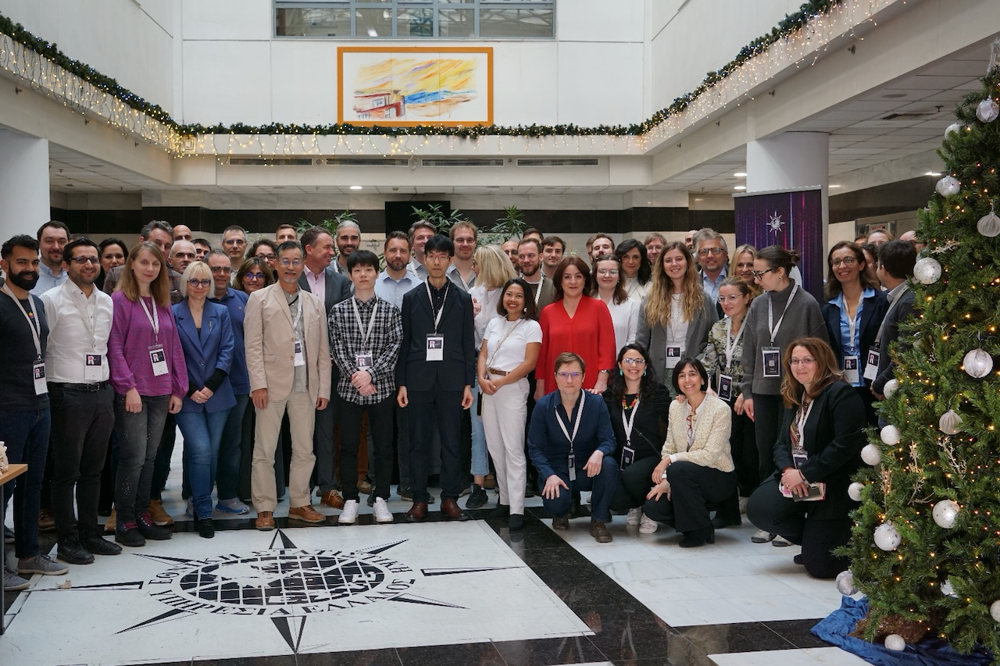
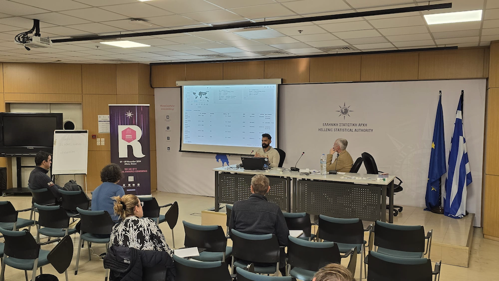

# uRos2024: Visualising Large Datasets using Shiny & Arrow

_Nov 27 2024_

I had the pleasure of talking about this topic at the [2024 uRos conference](https://r-project.ro/conference2024-live.html) held in Greece in Nov 2024. I spoke about how very simple tooling in `{shiny}`, combined with `{arrow}` can unlock the capability to develop some very powerful interactive tooling in R. I spoke about how we can be quickly scale up our development using shiny modules.




## Project Structure

### Key Files

- **app.R**: Main Shiny application

### Key Folders
- **docs/**: Contains my presentation
- **R/**: R scripts for data manipulation and Shiny modules
- **data/**: Datasets.
- **.devcontainer/**: Configuration for development container
- **.vscode/**: Visual Studio Code settings
- **docker/**: Docker configuration files

## Usage

Clone the repository:

```sh
git clone --depth 1 git@github.com:rsangole/uros2024-interactive_baseplots.git
```

### Running the Project in VS Code Using Dev Containers
1. Ensure Docker is installed and running on your machine.
1. Open the project folder in VS Code.
1. When prompted by VS Code, reopen the folder in the container.
1. If not prompted, open the Command Palette (Ctrl+Shift+P) and select `Remote-Containers: Reopen in Container`.
1. Once the container is built and running, install required R packages:
    ```R
    renv::restore()
    ```
1. Run the Shiny application:
    ```r
    shiny::runApp("app.R")
   ```
1. Access the application in your web browser at `http://localhost:3838`.

### Running the Project in RStudio

1. Open the Project:
    - Open RStudio and navigate to the project directory.
    - Open the `app.R` file.
2. Ensure Packages are Installed:
    - Install the required packages using `renv`:
      ```r
      renv::restore()
      ```
3. Open and run `app.R`

## Shiny Modules

Shiny modules for interactive visualization are located in the `R/` directory. Key modules include:

- `mod_ts.R`: Time series visualization module.
- `mod_basics.R`: Basic UI components for the application.